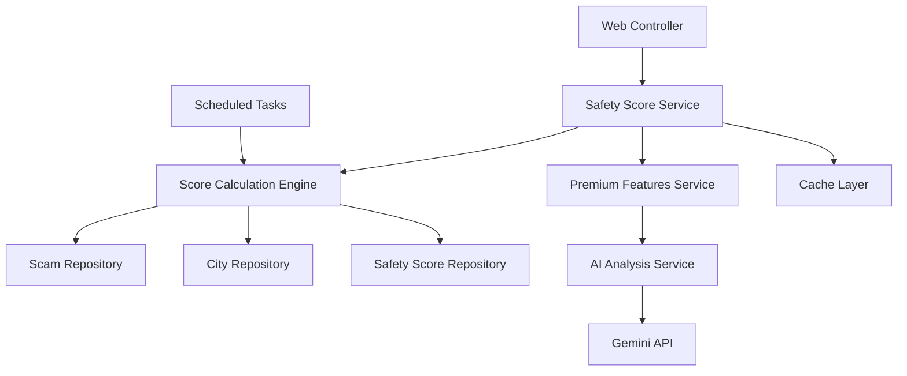

# Design Document

## Overview

The Travel Safety Score & Risk Assessment feature introduces a comprehensive safety scoring system that transforms raw scam data into actionable intelligence for travelers. The system calculates numerical safety scores (1-100) for cities using AI-powered analysis of scam frequency, severity, recency, and patterns. Premium users receive detailed risk breakdowns, personalized recommendations, and comparative analysis tools.

The feature leverages the existing Spring Boot architecture and PostgreSQL database while introducing new models, services, and controllers specifically for safety scoring. The design emphasizes performance through caching, scalability through batch processing, and monetization through a clear freemium model.

## Architecture

### High-Level Architecture



### Data Flow

1. **Score Calculation**: Batch process analyzes scam data and generates/updates safety scores
2. **Real-time Access**: Controllers serve cached scores with premium feature differentiation
3. **AI Enhancement**: Premium features trigger AI analysis for detailed insights
4. **Caching Strategy**: Scores cached for performance, invalidated on data updates

## Components and Interfaces

### Core Models

#### SafetyScore Entity
```java
@Entity
@Table(name = "safety_scores")
public class SafetyScore {
    @Id
    @GeneratedValue(strategy = GenerationType.IDENTITY)
    private Long id;
    
    @ManyToOne
    @JoinColumn(name = "city_id")
    private City city;
    
    private Integer overallScore; // 1-100
    private Integer financialRiskScore; // 1-100
    private Integer physicalRiskScore; // 1-100
    private Integer digitalRiskScore; // 1-100
    
    private Integer totalScamCount;
    private Integer recentScamCount; // Last 6 months
    private Double confidenceLevel; // 0.0-1.0
    
    @Column(columnDefinition = "TEXT")
    private String topScamTypes; // JSON array of top 3 scam types
    
    @Column(columnDefinition = "TEXT")
    private String aiInsights; // Premium AI-generated insights
    
    private LocalDateTime lastCalculated;
    private LocalDateTime lastUpdated;
}
```

#### SafetyScoreHistory Entity
```java
@Entity
@Table(name = "safety_score_history")
public class SafetyScoreHistory {
    @Id
    @GeneratedValue(strategy = GenerationType.IDENTITY)
    private Long id;
    
    @ManyToOne
    @JoinColumn(name = "city_id")
    private City city;
    
    private Integer previousScore;
    private Integer newScore;
    private String changeReason;
    private LocalDateTime calculatedAt;
}
```

### Service Layer

#### SafetyScoreService
Primary service handling score retrieval and basic operations:
```java
@Service
public class SafetyScoreService {
    // Core methods
    SafetyScore getScoreForCity(String cityName);
    List<SafetyScore> getScoresForCities(List<String> cityNames);
    boolean isScoreStale(SafetyScore score);
    
    // Premium methods
    SafetyScoreComparison compareScores(List<String> cityNames);
    List<SafetyAlert> getAlertsForUser(Long userId);
}
```

#### ScoreCalculationService
Handles the complex scoring algorithm:
```java
@Service
public class ScoreCalculationService {
    SafetyScore calculateScoreForCity(City city);
    void recalculateAllScores();
    void recalculateScoreForCity(Long cityId);
    
    // Internal calculation methods
    private Integer calculateOverallScore(ScamAnalysis analysis);
    private Integer calculateCategoryScore(List<Scam> scams, String category);
    private Double calculateConfidenceLevel(ScamAnalysis analysis);
}
```

#### PremiumFeaturesService
Manages premium-only functionality:
```java
@Service
public class PremiumFeaturesService {
    String generateAIInsights(City city, List<Scam> scams);
    SafetyScoreComparison generateComparison(List<SafetyScore> scores);
    List<String> generatePersonalizedRecommendations(User user, SafetyScore score);
    
    // Subscription validation
    boolean hasValidPremiumSubscription(User user);
}
```

### Controller Layer

#### SafetyScoreController
```java
@RestController
@RequestMapping("/api/safety-scores")
public class SafetyScoreController {
    @GetMapping("/{cityName}")
    ResponseEntity<SafetyScoreResponse> getScoreForCity(@PathVariable String cityName, HttpSession session);
    
    @PostMapping("/compare")
    ResponseEntity<SafetyScoreComparison> compareScores(@RequestBody List<String> cityNames, HttpSession session);
    
    @GetMapping("/alerts")
    ResponseEntity<List<SafetyAlert>> getUserAlerts(HttpSession session);
}
```

### Data Models

#### Scoring Algorithm Components

**Base Score Calculation:**
- Scam Frequency Weight: 40%
- Scam Severity Weight: 30% 
- Recency Weight: 20%
- Data Confidence Weight: 10%

**Category-Specific Scoring:**
- Financial Risk: Credit card fraud, ATM scams, fake currency
- Physical Risk: Robbery, assault, dangerous areas
- Digital Risk: WiFi scams, fake apps, online fraud

**Confidence Factors:**
- Sample size (number of reports)
- Data recency (how recent the reports are)
- Source diversity (multiple report sources)
- Geographic specificity (city vs neighborhood level)

## Error Handling

### Score Calculation Errors
- **Insufficient Data**: Return default score with low confidence
- **Calculation Failure**: Log error, maintain previous score
- **API Timeout**: Graceful degradation without AI insights

### Premium Feature Errors
- **Subscription Validation**: Clear error messages, upgrade prompts
- **AI Service Unavailable**: Fallback to cached insights
- **Comparison Limits**: Enforce maximum city limits with user feedback

### Data Consistency
- **Concurrent Updates**: Use database locks for score calculations
- **Cache Invalidation**: Ensure cache consistency with database updates
- **Audit Trail**: Maintain history for all score changes

## Testing Strategy

### Unit Testing
- **Score Calculation Logic**: Test algorithm with various scam data scenarios
- **Premium Feature Validation**: Test subscription checks and feature access
- **AI Integration**: Mock Gemini API responses for consistent testing

### Integration Testing
- **Database Operations**: Test score persistence and retrieval
- **Cache Behavior**: Verify cache invalidation and refresh cycles
- **API Endpoints**: Test all REST endpoints with various user types

### Performance Testing
- **Score Calculation**: Benchmark batch calculation performance
- **Cache Performance**: Test cache hit rates and response times
- **Concurrent Access**: Test system under multiple simultaneous requests

### End-to-End Testing
- **User Journeys**: Test complete flows for free and premium users
- **Subscription Flows**: Test upgrade/downgrade scenarios
- **Data Pipeline**: Test from scam submission to score update

## Implementation Considerations

### Performance Optimization
- **Caching Strategy**: Redis cache for frequently accessed scores
- **Batch Processing**: Calculate scores during off-peak hours
- **Database Indexing**: Optimize queries for city-based lookups

### Scalability
- **Horizontal Scaling**: Stateless services for easy scaling
- **Database Partitioning**: Consider partitioning by geographic region
- **API Rate Limiting**: Protect against abuse of premium features

### Security
- **Subscription Validation**: Secure token-based premium access
- **Data Privacy**: Anonymize user data in analytics
- **API Security**: Rate limiting and authentication for all endpoints

### Monitoring and Analytics
- **Score Accuracy**: Track user feedback on score accuracy
- **Feature Usage**: Monitor premium feature adoption rates
- **Performance Metrics**: Track calculation times and cache hit rates
- **Business Metrics**: Monitor conversion rates and subscription retention