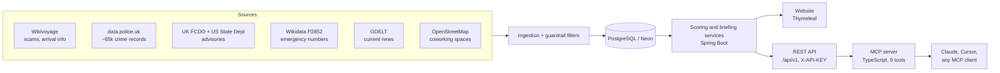

# RoamSafe

Evidence-backed travel safety intelligence, available as a website, a REST API
and an MCP server for AI agents.

**Live:** https://roam-safe.brimble.app

RoamSafe answers "what should I watch out for in this city?" using only public,
attributable sources: Wikivoyage, UK police-recorded crime, government travel
advisories, Wikidata, GDELT news and OpenStreetMap. Its governing rule is
**never invent**. Every score is computed from real records, every claim links
back to its source, and when the data doesn't cover something the product says
so instead of filling the gap.

That rule matters most on the AI surface. An agent that asks RoamSafe about a
city it doesn't cover gets "no coverage", not a plausible-sounding score.

---

## Three interfaces, one intelligence layer



The website, REST API and MCP server all read from the same services, and
`mcp/cross-interface.test.mjs` checks that all three report the same facts for
the same city.

### Website

| Page | What it does |
|---|---|
| **City report** `/scams?city=Paris` | Safety score with confidence, neighborhood scores, documented scams with prevention tips, official advisories, emergency numbers, current news ("Happening now") and arrival information |
| **Library** `/scams` | Browse and search the scam library, e.g. "bracelet scam Paris" |
| **Streets** `/street` | Reports for one street, square or district, with better-scoring areas nearby |
| **Compare** `/compare` | Two or more destinations side by side, on the same evidence |
| **Trip guide** `/guide` | One printable guide (or saved PDF) for a multi-stop route |
| **Latest reports** `/feed` | Newest additions to the library, filterable by category and severity |

Everything is free and needs no account. Anyone can submit a report; it is held
as pending until an admin reviews it. An account lets you save a trip to your
dashboard.

### REST API

All endpoints are under `/api/v1` and authenticated with an `X-API-KEY` header.

| Endpoint | Returns |
|---|---|
| `GET /cities` | Covered cities with scores and report counts |
| `GET /risk/city/{city}` | Full city profile: score, risk by concern, neighborhoods, night risk, evidence metadata, current incidents |
| `GET /street?q=` | Street- or district-level intelligence |
| `GET /emergency/{country}` | Emergency numbers from Wikidata |
| `GET /practical/{city}` | Arrival and getting-around information |
| `GET /incidents?city=` | Current news incidents, marked unverified |
| `GET /alerts/feed` | Paginated feed of the newest reports |

### MCP server

`mcp/` is a TypeScript [Model Context Protocol](https://modelcontextprotocol.io)
server. It runs over stdio by default, or as stateless Streamable HTTP when
`ROAMSAFE_MCP_PORT` is set. Every tool returns readable text plus
`structuredContent` JSON.

| Tool | Purpose |
|---|---|
| `list_covered_cities` | What RoamSafe can actually answer about. Agents are told to call this first instead of guessing |
| `get_city_safety` | Full city profile |
| `get_neighborhood_safety` | District-level scores |
| `street_intelligence` | One specific street or district |
| `compare_cities` | Rank up to 10 cities, overall or by concern |
| `get_emergency_numbers` | Emergency numbers; refuses to guess |
| `get_arrival_info` | Airport-to-city transport and arrival information |
| `list_current_incidents` | Current disruptions in the news, unverified |
| `list_recent_alerts` | Newest reports worldwide |

Some outcomes are deliberately different. A failed API call returns
`isError: true`, but "no coverage" is a normal result. It's a true answer, and
flagging it as an error would push agents into retry loops. Setup instructions
are in [`mcp/README.md`](mcp/README.md).

---

## Design decisions

These are the choices that make the product what it is. Most of them are
places where the obvious move would have been to add an LLM or a guess.

**Itinerary review is deliberately not a language model.**
`TripReviewService` matches a pasted itinerary against real reports, and every
finding carries the evidence behind it. A model asked the same question would
produce confident, unsourced advice, which is exactly the failure this codebase
exists to avoid. If nothing in the data speaks to a line of the itinerary, the
review says nothing about it.

**News headlines are stored verbatim and filtered strictly.**
A keyword search over world news for "Paris strike" returns things like
"Climate strike named Collin word of the year 2019". `GdeltIngestionService` only
keeps a story when the city is named in the headline itself *and* the headline
contains a disruption term. It also rejects retrospectives ("Today in History")
and collapses syndicated copies of one story. Headlines are never summarised,
because paraphrasing an unverified report would turn it into a RoamSafe
assertion. On a live sample this cut 30 Paris articles to 3, all of them
genuinely travel-affecting.

**Missing dates stay missing.**
Most imported reports have no incident date. They are left null rather than
backfilled, because a made-up date would let decade-old guidance pass as this
month's news. Recency weighting gives undated reports a neutral weight, and the
UI labels them "date unknown".

**Gaps are stated, not filled.**
The trip guide lists what it doesn't contain: embassy contacts, weather and visa
rules, none of which any ingested source carries. Compare shows "no coverage"
instead of an empty column that reads like a clean bill of health. Emergency
numbers come from structured Wikidata, never from free text, because a wrong
number costs someone time in a crisis.

**Scores show their working.**
Each city score comes with a confidence level, the number of reports behind it,
and a breakdown by concern.

**Scraped text is cleaned before anyone reads it as directions.**
Arrival information is shown to travellers as instructions, so the Wikivoyage
parser strips image captions, template fragments and other embedded markup that
would otherwise read as directions (`PracticalInfoParsingTest`).

---

## Tests

```bash
./mvnw test     # 46 tests
```

The guardrails are tested against real inputs that previously got through:

| Test | Guards against |
|---|---|
| `GdeltRelevanceTest` | Off-topic, retrospective and duplicated news appearing as current incidents |
| `ScamEntryFilterTest` | Non-scams ("Earthquake Risk", "Emergency Number 112") polluting the library and scores |
| `PlaceNamesTest` | Headings and objects ("Stay safe", "Taxi drivers") treated as places, and place lists split badly |
| `PracticalInfoParsingTest` | Wiki markup and embedded instructions leaking into arrival info |
| `AdminApiSecurityTest` | Unauthenticated access to ingestion and destructive admin endpoints |
| `SubmissionBindingTest` | A public submission publishing itself or overwriting an existing report |
| `GuideRouteParsingTest` | Routes typed as "Paris -> Brussels" or "Paris then Brussels" not parsing |

`mcp/cross-interface.test.mjs` runs against a live server and asserts that the
website, REST API and MCP server agree.

---

## Running locally

Requirements: Java 21 and a PostgreSQL database. Node 18+ is only needed for
the MCP server.

```bash
# .env in the project root, loaded on startup
DB_URL=jdbc:postgresql://localhost:5432/roamsafe
DB_USER=...
DB_PASS=...
ROAMSAFE_API_KEY=...      # partner access to /api/v1, which the MCP server sends
ROAMSAFE_ADMIN_KEY=...    # ingestion and maintenance under /api/admin

./run_dev.sh              # http://localhost:8080
```

Both keys fail closed: if a key is unset, nothing authenticates with it.

MCP server:

```bash
cd mcp && npm install && npm run build
node dist/index.js                              # stdio
ROAMSAFE_MCP_PORT=8791 node dist/index.js       # Streamable HTTP
```

Deployment notes are in [`DEPLOY.md`](DEPLOY.md).

**Stack:** Java 21, Spring Boot 3.2, Spring Security 6, Thymeleaf,
PostgreSQL (Neon), TypeScript MCP SDK. Hosted on Brimble.

---

## Known limits

- **Undated reports.** Most library entries come from evergreen sources without
  incident dates, so the score can't yet show trends over time.
- **Missing provenance on older rows.** About 1,400 reports imported before
  per-report source fields existed have no source URL. Re-running the
  Wikivoyage import fills it in.
- **No CI yet.** The tests run locally; nothing runs them on push.
- **UK crime only.** Official recorded crime currently comes from
  data.police.uk, so UK cities have the deepest data.
